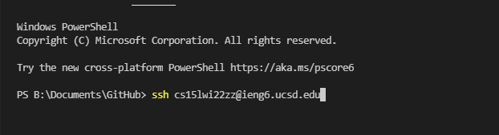
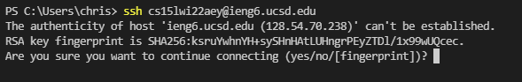
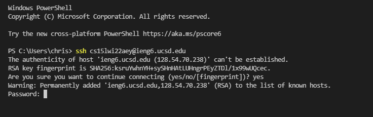
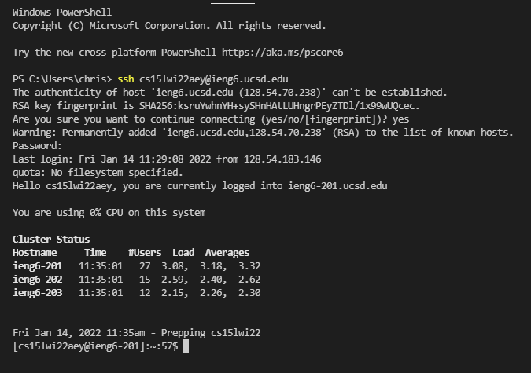

# How to install VS code:
VS is a good tool to use when writing programs in any programming languages, editing text files, or web development. 
To install VS code, visit the website [https://code.visualstudio.com/](https://code.visualstudio.com/) and go ahead and click the download
button for the correct system.

# Remotely Connecting to CSE server using course-specific account
To get your course-specific account, go to [https://sdacs.ucsd.edu/~icc/index.php](https://sdacs.ucsd.edu/~icc/index.php) and login with your university info. 
You will be given instuctions on how to active your course-specific if you haven't activated it yet. 

# Install OpenSSH
Before we access the ieng6 server, you would need to install [OpenSSH](https://docs.microsoft.com/en-us/windows-server/administration/openssh/openssh_install_firstuse).

# Connecting to Remote server
Now, you will need to open terminal in your VS code by using **(Ctrl or Command + `, or use the Terminal --> New Terminal menu option)**. Opening terminal, you will need to type what is shown in the screenshot below but replace the aey with the letters in your course-specific account.

You then want to push enter and a message will be prompted towards you.

You will want to type in "yes" because it's a trusted server and you know your security is valued. This doesn't go to say all servers value your security so be mindful in who's server you are connecting to. Once you type in yes and push enter, you will be asked your course-specific account password. Make sure to type it in correctly to login. While you type in your password, it won't show that you are typing for security reasons, so type slowly to make sure you are inputting your password correctly. 

Once you type in your password correctly you will be connected to the ieng6 server and given information about your account.

# Trying Some Commands
You can try run these useful commands:
* cd ~
* cd
* ls -lat
* ls <directory> where <directory> is /home/linux/ieng6/cs15lwi22/cs15lwi22aey, where the "aey" is one of the other group members' username
* cp /home/linux/ieng6/cs15lwi22/public/hello.txt ~/
* cat /home/linux/ieng6/cs15lwi22/public/hello.txt

If you want to logout the ieng6 server, you can either uses **Ctrl-D** or type in "**exit**" or "**logout**"

# Moving Files with "scp"

# Settings an SSH key

# Optimizing Remote Running
