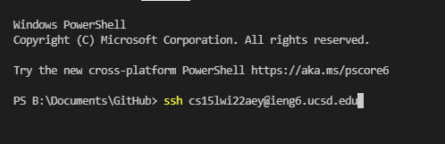
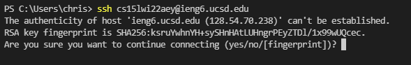
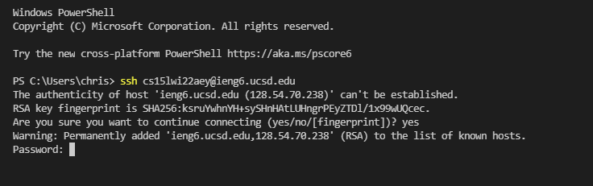
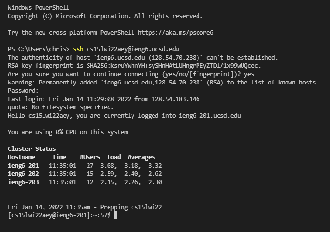
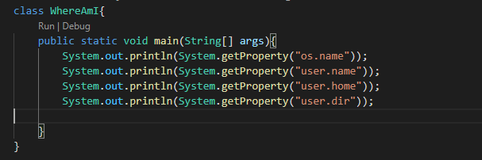
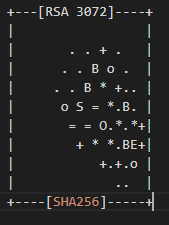

# How to install VS code:
VS is a good tool to use when writing programs in any programming languages, editing text files, or web development. 
To install VS code, visit the website [https://code.visualstudio.com/](https://code.visualstudio.com/) and go ahead and click the download
button for the correct system.

# Remotely Connecting to CSE server using course-specific account
To get your course-specific account, go to [https://sdacs.ucsd.edu/~icc/index.php](https://sdacs.ucsd.edu/~icc/index.php) and login with your university info. 
You will be given instuctions on how to active your course-specific if you haven't activated it yet. 

# Install OpenSSH
Before we access the ieng6 server, you would need to install [OpenSSH](https://docs.microsoft.com/en-us/windows-server/administration/openssh/openssh_install_firstuse).

# Connecting to Remote server
Now, you will need to open terminal in your VS code by using **(Ctrl or Command + `, or use the Terminal --> New Terminal menu option)**. Opening terminal, you will need to type what is shown in the screenshot below but replace the aey with the letters in your course-specific account.

You then want to push enter and a message will be prompted towards you.

You will want to type in `yes` because it's a trusted server and you know your security is valued. This doesn't go to say all servers value your security so be mindful in who's server you are connecting to. Once you type in yes and push enter, you will be asked your course-specific account password. Make sure to type it in correctly to login. While you type in your password, it won't show that you are typing for security reasons, so type slowly to make sure you are inputting your password correctly. 

Once you type in your password correctly you will be connected to the ieng6 server and given information about your account.

# Trying Some Commands
You can try run these useful commands:
* cd ~
* cd
* ls -lat
* ls <directory> where <directory> is /home/linux/ieng6/cs15lwi22/cs15lwi22aey, where the "aey" is one of the other group members' username
* cp /home/linux/ieng6/cs15lwi22/public/hello.txt ~/
* cat /home/linux/ieng6/cs15lwi22/public/hello.txt

If you want to logout the ieng6 server, you can either uses **Ctrl-D** or type in "**exit**" or "**logout**"

# Moving Files with "scp"
Now you will learn to move files over SSH using the scp command. 
1. Create a file called "WhereAmI.java" and the file should contain:
    
2. Run the java file you just created using "javac" and java on your computer. If you don't have java on your computer, don't worry about this step.
3. To run java code on the server computer, type: `scp WhereAmI.java cs15lwi22zz@ieng6.ucsd.edu:~\`
4. Terminal will ask for your course-specific password, so go ahread and type that in.
5. Now you will see that you can run java on the ieng6 computer using the "javac" and "java" commands. 

# Settings an SSH key
When logging in the ieng6 server, you will always need to type in your password for your course-specific account which gets annoying when you needed to access the server most of the time. I will be teaching you how to make a SSH key which will allow you to connect to the ieng6 server without needing to type in your password. 

1. On your client (your computer) you will type in the command "ssh-keygen" in terminal. This will generate a public/private rsa key pair.
2. Terminal will ask you which file to save the key "(/User/username/.ssh/id_rsa):" but the username will be your computer's username.
3. You will then type `/User/username/.ssh/id_rsa` but replace "username" with your computer's username and hit enter.
4. The terminal will ask for a passphrase but since you don't have one, nor create one, just hit enter without typing in anything.
5. It will ask you to type in passphrase again, you will just hit enter without typing anything.
6. You will then be given a key fingerprint and a randomart image for your key which will look something like:
    
7. If you are on windows, follow the additional steps provided by [https://docs.microsoft.com/en-us/windows-server/administration/openssh/openssh_keymanagement#user-key-generation](https://docs.microsoft.com/en-us/windows-server/administration/openssh/openssh_keymanagement#user-key-generation)
8. Now log into the server and which will still prompt you to type in your password. Once you are on the server, you will type in `mkdir .ssh` and hit enter.
9. You will logout the server.
10. Now on your client, you will type in the command, `scp /Users/username/.ssh/id_rsa.pub cs15lwi22@ieng6.ucsd.edu:~/.ssh/authorized_keys` you will change "username" to your computer's username and hit enter.
11. Now you are set to use scp and log into the ieng6 server without needing to type in your course-specific account password everytime. 

# Optimizing Remote Running
Now let's make remote running even more pleasant to do.

Type in the command: `ssh cs15lwi22aey@ieng6.ucsd.edu "ls" ` but replace the "aey" with your course-specific account letters.
You will be shown what's in your account folder which will include the WhereAmI.java file. 

# Useful Keystrokes
By using the **up-key** I was able to access previous written commands, such as `ssh cs15lwi22amn@ieng6.ucsd.edu`, which used 2 keystrokes (**up-key + enter**).

**You can also use semicolons to run multiple commands on the same line:** 
I copied and pasted this command which allows me to run multiple commands on the same line. It took 5 keystrokes to complete, (**control + c** and **control + v**) and to hit enter. 
`cp WhereAmI.java OtherMain.java; javac OtherMain.java; java WhereAmI`

  **WhereAmI.java should now look like this:**

**Results from updated code:**

There was 7 keystrokes used in total to make a local edit. The edit was made in WhereAmI.java file. The screenshot below can show how `System.out.println("Hello World!");` was written and saved in the file.

 
# Summary
This blog page has taught you how to download VS code and connect to a remote server. You had OpenSSH setup on your computer and learned how to move files from your computer to a server. You also had a SSH key configured on your computer so you can connect to a remote server without needed to type in your password everytime you want to access the server. 

