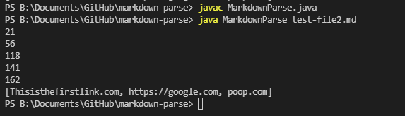

# Lab Report 2
When working in labs, I forked the professors program. The TA told us that we will have our own copy of the code so we didn't work on the same file. We still collectivly found bugs in the code and discussed how to fix the bugs. Here is the code forked from the professor:

# First Problem of the code
Since image links are very similar to website links, the program will add the image links to the list. The only difference that the image link has is the "!" at the start of the link which we can take into account in order to fix that bug in the algorithm. 

We added an instruction to ignore image links so we can only add website links to the ArrayList.

This fix caused an issue if the first line didn't contain an image link. It will give us an out of bound error. 

**With an image link in the first line of the Test File:**

**Without an image link in the first line of the Test File:**

As you can see, when there isn't a image link at the start of the Test File, there will be an index out of bound of -1 since the first bracket has an index of 0 since it's at the start of the file and has nothing before it. 

# Fully Working Code:

withoutImageLink