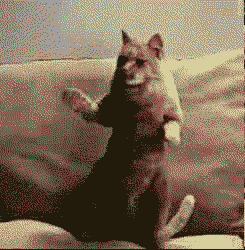

# Lab Report 2
When working in labs, I forked the professors program. The TA told us that we will have our own copy of the code so we didn't work on the same file. We still collectivly found bugs in the code and discussed how to fix the bugs. Here is the code forked from the professor:

**Here is the output of the professor's code using test-file.md:**

# Test files that will be used to test the program
[test-file1](test-file.txt)    
[test-file2](test-file2.txt)

# First Change of the Code
The professor's code didn't account to ignore image links so it adds them to the website links array which is incorrect. 

Since image links are very similar to website links, the program will add the image links to the list. The only difference that the image link has is the "!" at the start of the link which we can take into account in order to fix that bug in the algorithm. 

We added an instruction to ignore image links so we can only add website links to the ArrayList.

This fix caused an issue if the first line didn't contain an image link, it will give us an out of bound error. 

**With an image link in the first line of the Test File:**

**Without an image link in the first line of the Test File:**

As you can see, when there isn't a image link at the start of the Test File, there will be an index out of bound of -1 since the first bracket has an index of 0 since it's at the start of the file and has nothing before it. 

# Second Change of the Code
Now the program won't crash where there is no image found in the first line. I have altered the code so there will be no error when it's check for a link in the first line but there is still a bug present after the updated code. 

**With test-file2.md, it doesn't crash and doesn't put the image that is found in the first line in the ArrayList:**

**The bug present is that it doesn't put the link that is in the first line into the ArrayList:**

This output is missing "https://something.com". The ArrayList should have been: 
`[https://something.com, some-page.html]`

# Third Change of the Code
Now with this this third change, the program works by completely ignoring the image links and only taking the website links. 

**Output of Program:**

# Simplified and Fully Working Code:
This is the code fully working where it only takes the links for websites and completely ignores image links. This is the same code just simplified a little.

# Summary
The main bug that was present in the program was how images were added in the Links ArrayList. The sympotom of the bug was seeing the images in the ArrayList. The failure-inducing input was the links that were present in the test-files. 

