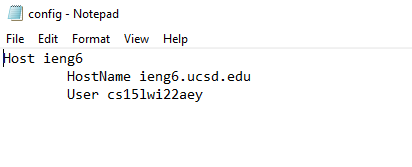
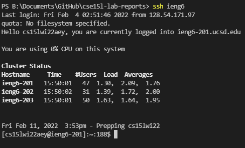
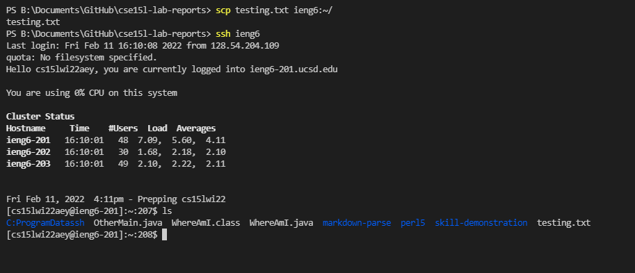

# Lab Report 3: Screamlining `ssh` Configuration

# Screenshot of .ssh/config file

This file contains the information to log into the server very quickly with just using the command `ssh ieng6`

# Running the `ssh` command logging me in

I only need to type `ssh ieng6` to log into the server.

# Copying files using `scp` command using alias

I was able to copy files from my computer to the server without having to type out all my information for the server, I just needed to type `scp testing.txt ieng6:~/`

