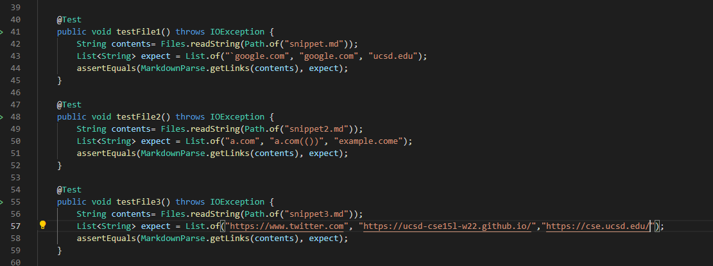
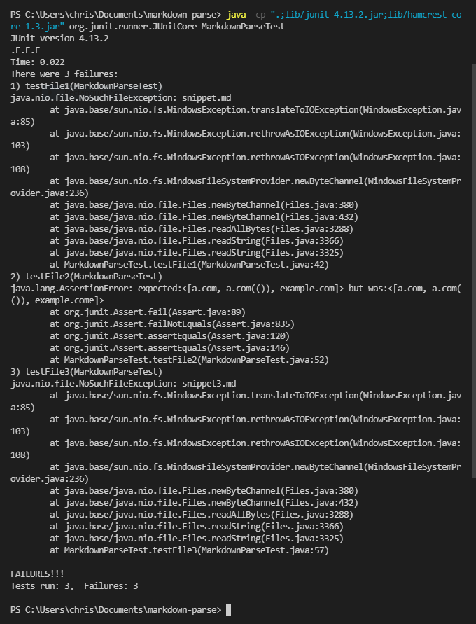

# Lab Report 4 

Link to my MarkdownParse Repository: [My Repository](https://github.com/therealstezzy/markdown-parse.git)

Link to Group Reviewed MarkdownParse Repository: [Other Group Repository](https://github.com/zfxd/markdown-parse.git)

# Expected output for Each Snippet:
1. Snippet 1: ``["`google.com", "google.com", "ucsd.edu"]``
2. Snippet 2:`["a.com", "a.com(())", "example.com"]`
3. Snippet 3:`[https://www.twitter.com, https://ucsd-cse15l-w22.github.io, https://cse.ucsd.edu/]`

# Code for Tests from my MarkdownParse.java:

# jUnit Testing Output:

# Answer to question:
1. Do you think there is a small (<10 lines) code change that will make your program work for snippet 1 and all related cases that use inline code with backticks? If yes, describe the code change. If not, describe why it would be a more involved change.

- There is an easy way to fix the issues related to the backticks that are included in the link. I could always add a line of code to ignore backtick and move on to the next index. For an extra bracket, I would set a counter for brackets and if it exceeds two. I would only take the first and last bracket recorded to account. All this can be achieved with at least 10 lines of code.

2. Do you think there is a small (<10 lines) code change that will make your program work for snippet 2 and all related cases that nest parentheses, brackets, and escaped brackets? If yes, describe the code change. If not, describe why it would be a more involved change.

- With nested parentheses, brackets, and escape brackets, I can have a counter for each and only include the index for the first and last parenthesis, brackets, and escape brackets. This prevent the link containing parentheses, brackets or escaped brackets. 

3. Do you think there is a small (<10 lines) code change that will make your program work for snippet 3 and all related cases that have newlines in brackets and parentheses? If yes, describe the code change. If not, describe why it would be a more involved change.

- I can say it will be really hard to fix this issue because it would be more than 10 lines of code to resolve this issue. One way to do it would be ignoring all whitespaces. I would get the index of the first parenthesis and start copying the link to the arraylist once I reach the link's index and end index. 