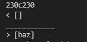
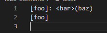
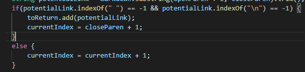
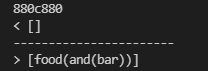
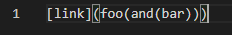
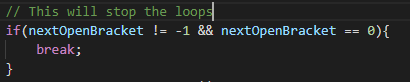

# Lab Report 5: Different bugs
I found the test with different results using the command:
`diff markdown-parse/results.txt markdown-parse markdown-parse/NewMarkdownParse/results.txt`

The command outputs all the differencers between results.txt of my markdown-parse and the prfoessors markdown-parse.

## First Difference I found in:
test.files/201.md

This is the output of my markdownParse compared to the professors

The File's content were: 

I can say that this should return an empty ArrayList because there are characters between the closed bracket and open parenthesis, which indicates it is not a link. My implementation is correct for this file and I believe that professor's implementation is incorrect.

The bug in this code doesn't check if there are charactres between the closed bracket and open barenthesis. An extra condition much be assed to satisiy this test.

## The Second Difference I found: 
test-files/495.md

This is the output of my markdownParse compared to the professors

The File's content were: 

The code should return `[foo(and(bar))]`, but my implementation is causing a bug

